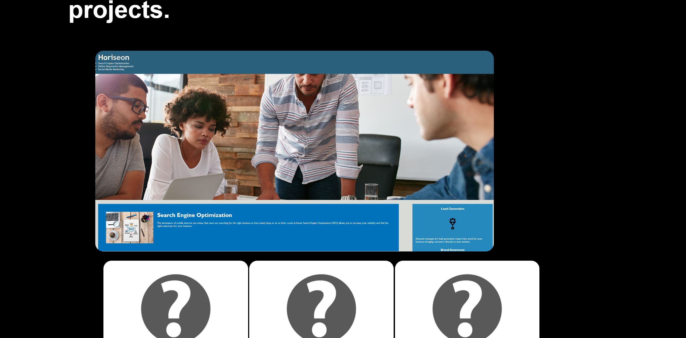

# week-2---02-Advanced-CSS-Portfolio---yasir-jamah

## User Story
AS AN employer
I WANT to view a potential employee's deployed portfolio of work samples
SO THAT I can review samples of their work and assess whether they're a good candidate for an open position

## description
This website offers two primary areas that together make for an interesting introduction to my abilities and experiences:

- **About Me**: Discover my love for coding and my aptitude for fixing issues.
- **Projects**: Look through a number of software initiatives that showcase my abilities and ingenuity.

## Key Features: 

- **Interesting Design**: The website has an eye-catching and enduring design.
- **Easy Navigation**: Visitors can easily switch between sections thanks to the navigation's clear layout.

### Deployment link

### Screenshots

